# Clone de Twitter

Este repositorio toma como código base la implementación del repositorio <b>Twitter-Clone</b> realizado por el desarrollador [Mert Çankaya](https://github.com/MertCankaya/Twitter-Clone).

## **Prerrequisitos**

-   [Git](https://git-scm.com/downloads) - Sistema de control de versiones
-   [React](https://es.reactjs.org/) - Framework
-   [Visual Studio Code](https://code.visualstudio.com/download) - IDE

## Configuracion en Cognito

-   [Video tutorial](https://www.youtube.com/watch?v=8WZmIdXZe3Q&list=PLDckhLrNepPR8y-9mDXsLutiwsLhreOk1)
-   Entrar a cognito en AWS
    -   Configurar todo
        -   En la parte de clientes de aplicación -> quitamos el check de 'Generar clave secreta de cliente'
-   Configurar un DNS

## Instalacion de libreria en REACT

-   npm i amazon-cognito-identity-js

## **Instrucciones de ejecución local**

0. Desde cmd clonar el repositorio

```git
git clone https://github.com/Rincon10/AREP-LAB04.git
```

1. Ubicarse en la carpeta Twiter-Front-End

```
cd Twiter-Front-End
```

2. instalamos todas las dependencias necesarias

```
npm install
```

3. Ejecucion del proyecto

```
npm start
```

## Pantallas disponibles

### Login

#### LogginPage-wrong-password

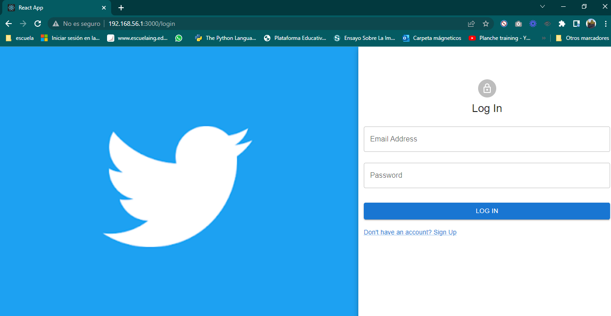
<br />
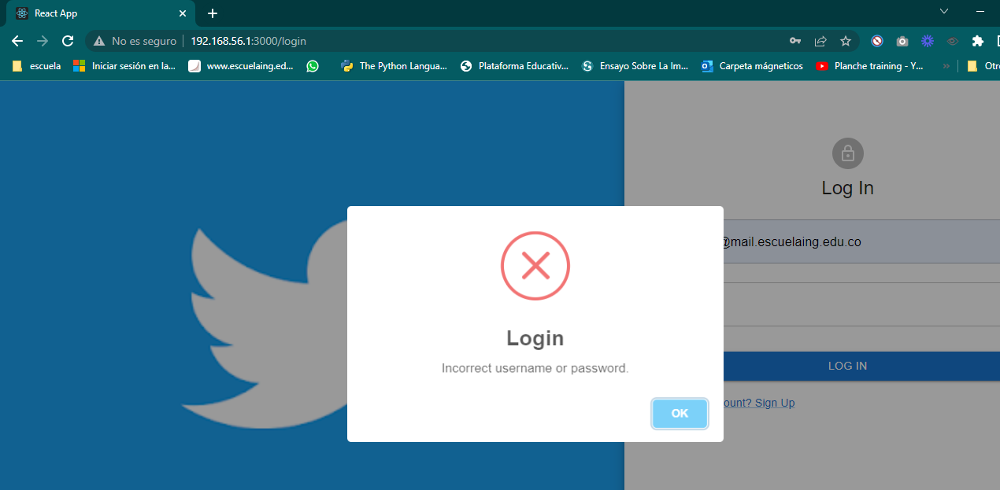

### SignIn

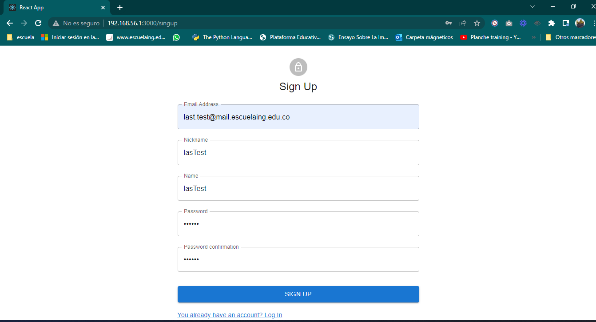
<br />
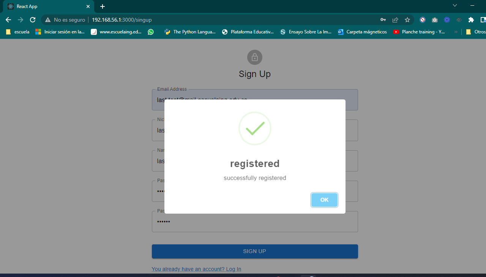
<br />
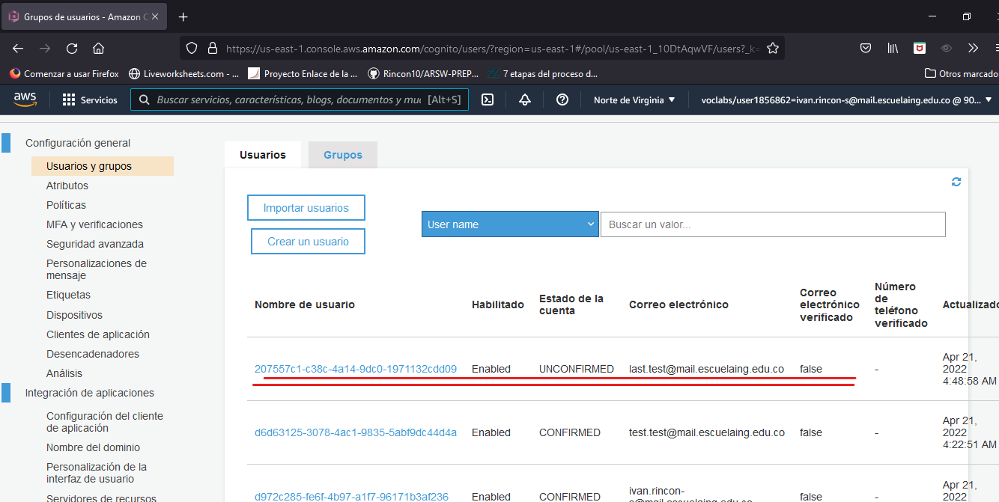

### Home

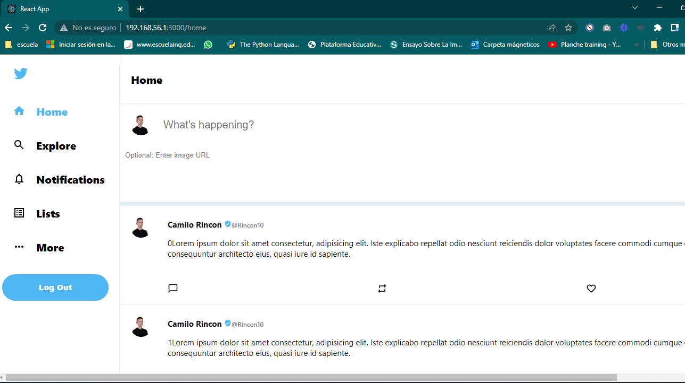

#### AddingATweet

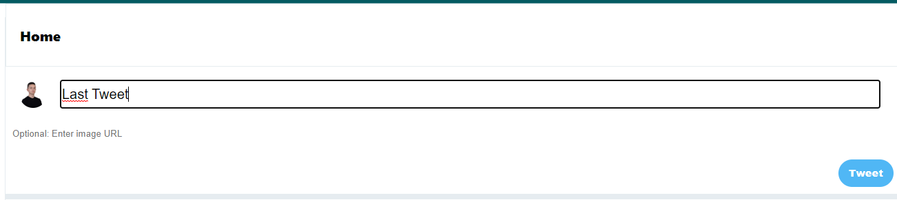

#### TweetAdded

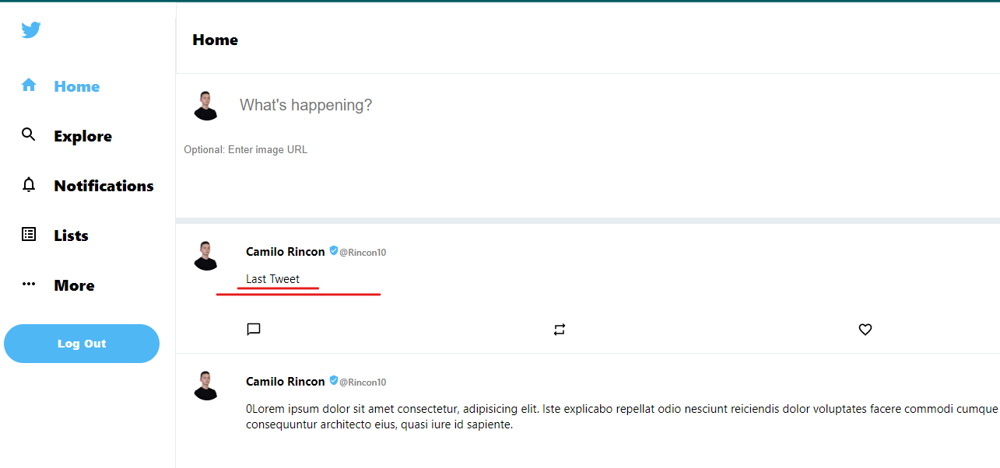

### Explicacion Despliegue Front en S3

[tutorial](https://www.youtube.com/watch?v=s0ZGeSVconI)

Nos dirigiremos a AWS y crearemos un bucket S3

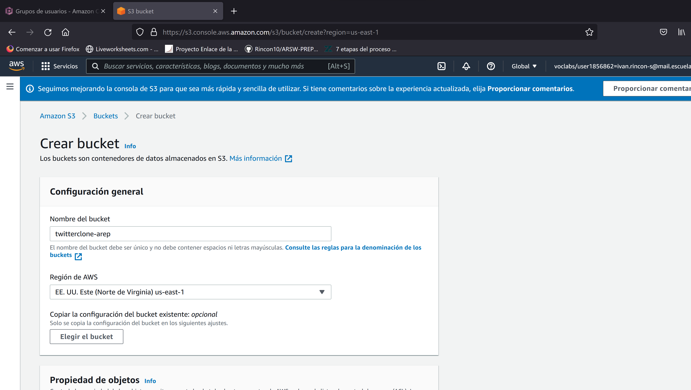

Ahora nos dirigiremos a la politica que maneja S3 y la modificaremos con la siguiente plantilla

```
{
    "Version": "2012-10-17",
    "Statement": [
        {
            "Sid": "PublicReadGetObject",
            "Effect": "Allow",
            "Principal": "*",
            "Action": [
                "s3:GetObject"
            ],
            "Resource": [
                "arn:aws:s3:::[NOMBRE_BUCKET]/*"
            ]
        }
    ]
}
```

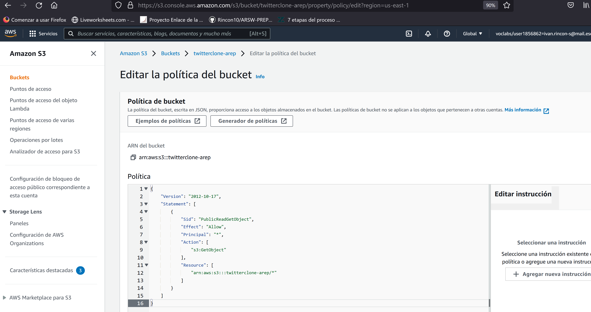

Ahora habilitaremos el alojamiento de sitios web estáticos, en la seccion de propiedades

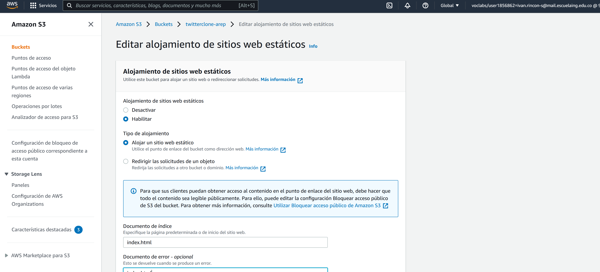

Ahora procederemos a crear el build de nuestro Front End con el siguiente comando

```
npm run-script build
```

Una vez tengamos el build generado por nuestra aplicacion de react, nos dirigiremos a objetos en nuestro panel de administracion de S3

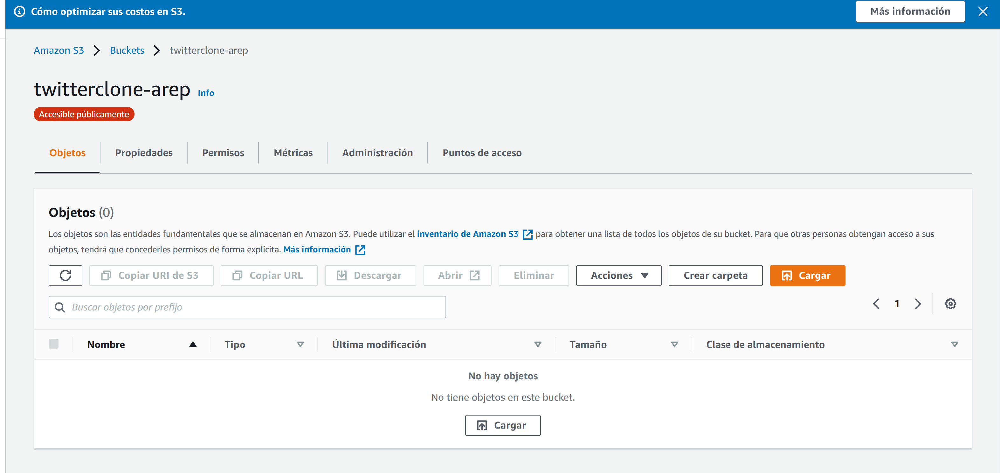

Cargaremos todos los archivos generados anteriormente como se aprecia en la siguiente imagen

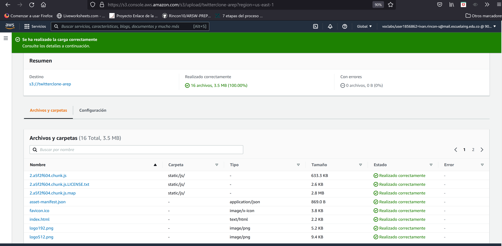

Estos son las entidades fundamentales que se almacenan en Amazon S3. Puede utilizar el inventario de Amazon S3

Si todo salio correctamente, buscaremos el url de nuestro bucket en propiedades de nuestro S3


Veremos nuestra pagina desplegada en AWS

## AWS URL front

```
http://twitterclone-arep.s3-website-us-east-1.amazonaws.com
```

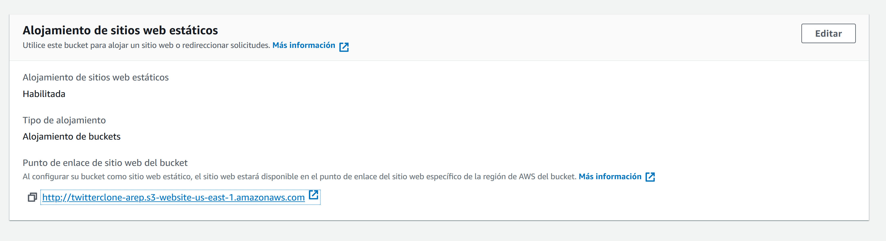

<br />

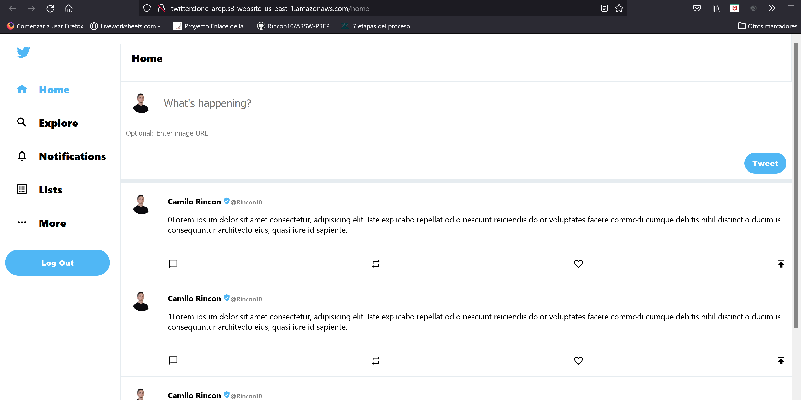

## Autor

Mert Çankaya

## Modificaciones con fines educativos

-   [Iván Camilo](https://github.com/Rincon10).
-   [Leonardo Galeano](https://github.com/Ersocaut).
    `
